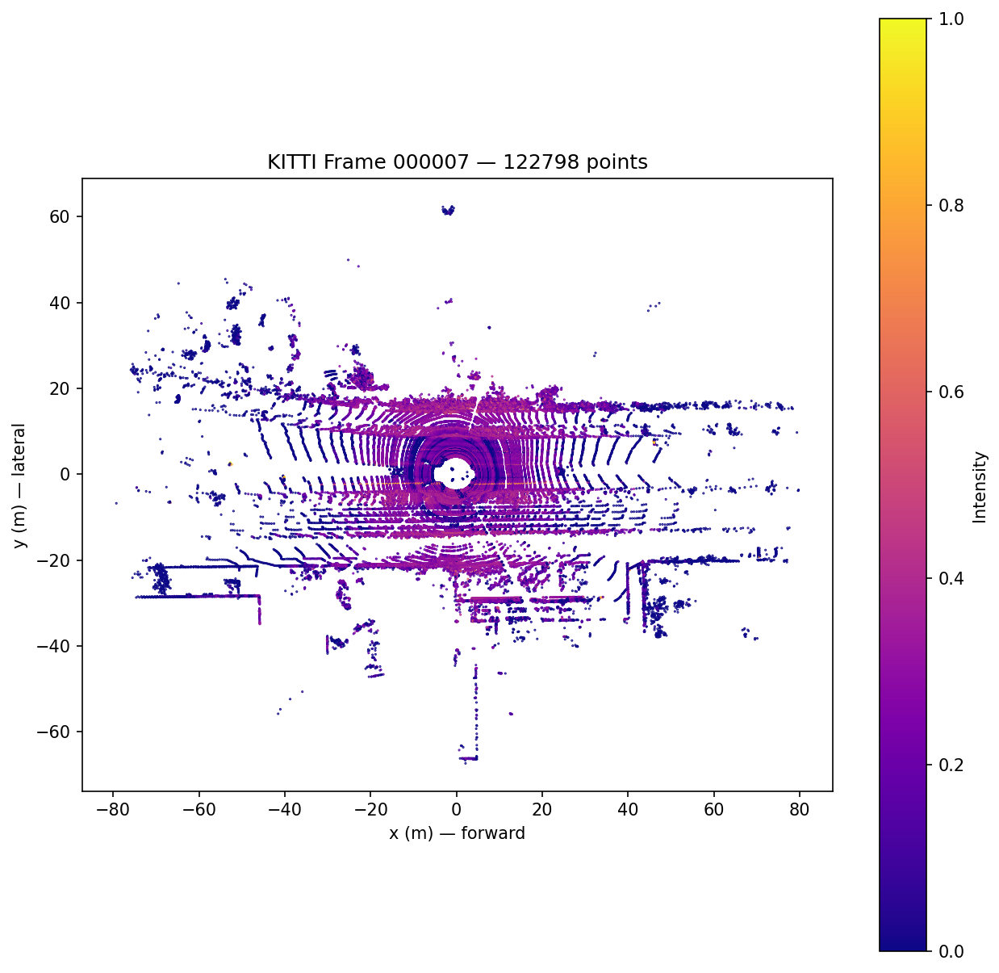

> CPU Generated Birds Eye View from KITTI Data

# voxelize

A CUDA C++ kernel that converts raw LiDAR point clouds into the pillar-voxel representation consumed by 3D object detection networks.

---

## Background

This project takes point clouds and turns them into 3D pillars in a BEV grid. This allows for 3D space to be processed by a normal CNN the same as a 2D image would be.

---

## Evaluation

**1. Benchmark table** comparing this kernel against OpenPCDet's `voxel_generator` at four point cloud densities on an RTX 1060:

| Points | This kernel (ms ± σ) | OpenPCDet (ms ± σ) | Speedup |
|--------|----------------------|--------------------|---------|
| 25k    | —                    | —                  | —       |
| 50k    | —                    | —                  | —       |
| 100k   | —                    | —                  | —       |
| 130k   | —                    | —                  | —       |

---

## Repository Structure

```
voxelize/
├── csrc/
│   ├── voxelize.cu
│   ├── voxelize.h
│   └── voxelize_ext.cpp
├── voxelize/
│   ├── __init__.py
│   └── cpu_reference.py
├── tests/
│   ├── test_correctness.py
│   └── test_benchmark.py
├── benchmarks/
│   ├── benchmark.py
│   ├── profile_kernel.py
│   └── baseline.json
├── scripts/
│   └── explore_kitti.py
├── .github/
│   └── workflows/
│       └── ci.yml
├── setup.py
├── Makefile
└── README.md
```

---

## Hardware Requirements

This runs entirely on an RTX 1060 3GB. Only kernel execution and benchmarking is done here, no model training.

| Resource | Requirement |
|----------|-------------|
| GPU | Any NVIDIA GPU |
| VRAM | 2GB minimum |
| CUDA Toolkit | 12.x |
| Python | 3.10+ |
| PyTorch | 2.x |

---

# Sources
>PointPillars (Lang et al., CVPR 2019)
